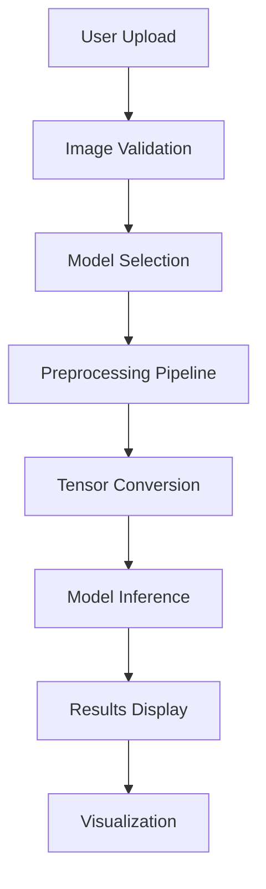

# 🖼️ Image Classification App

[](https://nextjs.org/)
[](https://www.typescriptlang.org/)
[](https://www.tensorflow.org/js)
[](https://tailwindcss.com/)
[](https://ui.shadcn.com/)

> A powerful web application that classifies images using multiple pre-trained machine learning models with real-time preprocessing visualization.

## 🎯 Overview

The Image Classification App is a sophisticated machine learning application that allows users to upload images and classify them using three different pre-trained models. It provides detailed insights into the preprocessing steps and delivers accurate classification results with confidence scores.

## ✨ Features

### 🤖 Multi-Model Support
- **CIFAR-100**: 100 fine-grained classes from 20 superclasses
- **MobileNet v2**: 1000 ImageNet classes, optimized for mobile devices
- **EfficientNet-B0**: 1000 ImageNet classes with balanced accuracy and efficiency

### 🖼️ Image Processing
- **Drag & Drop Upload**: Intuitive file upload interface
- **Real-time Preprocessing**: Visual representation of image transformations
- **Multiple Format Support**: JPG, PNG, GIF up to 5MB
- **Responsive Design**: Works seamlessly across all devices

### 📊 Classification Results
- **Top 5 Predictions**: Ranked results with confidence scores
- **Superclass Grouping**: Hierarchical classification information
- **Interactive Progress Bars**: Visual confidence representation
- **Model Comparison**: Switch between different AI models

### 🔍 Preprocessing Visualization
- **Step-by-Step Process**: Original → Resized → Normalized
- **Technical Details**: Model-specific preprocessing information
- **Visual Comparison**: Side-by-side transformation display

## 🏗️ Architecture



## 📋 Model Specifications

| Model | Classes | Input Size | Accuracy | Speed | Use Case |
|-------|---------|------------|----------|-------|----------|
| **CIFAR-100** | 100 | 32×32 | Medium | Fast | Fine-grained object classification |
| **MobileNet v2** | 1000 | 224×224 | Medium-High | Very Fast | Mobile/edge deployment |
| **EfficientNet-B0** | 1000 | 224×224 | High | Medium | Balanced accuracy/efficiency |

## 🚀 Getting Started

### Prerequisites

- Node.js 18.0 or higher
- npm or yarn package manager
- Modern web browser with WebGL support

### Installation

1. **Clone the repository**
   ```bash
   git clone <repository-url>
   cd image-classification-app
   ```

2. **Install dependencies**
   ```bash
   npm install
   ```

3. **Create package-lock.json** (if missing)
   ```bash
   npm install --package-lock-only
   ```

4. **Start development server**
   ```bash
   npm run dev
   ```

5. **Open in browser**
   ```
   http://localhost:3000
   ```

## 🛠️ Tech Stack

### Frontend Framework
- **Next.js 14**: React framework with App Router
- **TypeScript**: Type-safe JavaScript development
- **Tailwind CSS**: Utility-first CSS framework

### UI Components
- **Shadcn/ui**: Modern component library
- **Radix UI**: Accessible component primitives
- **Lucide React**: Beautiful SVG icons

### Machine Learning
- **TensorFlow.js**: Browser-based ML inference
- **Pre-trained Models**: CIFAR-100, MobileNet, EfficientNet
- **WebGL Acceleration**: GPU-accelerated computations

### Development Tools
- **Vite**: Fast build tool and dev server
- **ESLint**: Code linting and formatting
- **PostCSS**: CSS processing and optimization

## 📁 Project Structure

```
image-classification-app/
├── 📁 app/                    # Next.js App Router
│   ├── page.tsx              # Main application page
│   ├── layout.tsx            # Root layout component
│   ├── globals.css           # Global styles
│   └── actions.ts            # Server actions
├── 📁 components/            # React components
│   ├── 📁 ui/               # Shadcn/ui components
│   ├── image-uploader.tsx   # File upload component
│   ├── model-selector.tsx   # Model selection interface
│   ├── results-display.tsx  # Classification results
│   └── preprocessing-steps.tsx # Processing visualization
├── 📁 lib/                  # Utility libraries
│   ├── utils.ts            # Helper functions
│   ├── model.ts            # ML model utilities
│   ├── image-processing.ts # Image preprocessing
│   ├── cifar100-classes.ts # CIFAR-100 class definitions
│   └── imagenet-classes.ts # ImageNet class definitions
├── 📁 models/              # Pre-trained model files
│   ├── cifar100/          # CIFAR-100 model
│   ├── mobilenet/         # MobileNet model
│   └── efficientnet/      # EfficientNet model
└── 📁 hooks/              # Custom React hooks
    └── use-toast.ts       # Toast notification hook
```

## 🎨 UI Components

### Core Components
| Component | Description | Features |
|-----------|-------------|----------|
| `ImageUploader` | File upload interface | Drag & drop, validation, preview |
| `ModelSelector` | Model choice interface | Cards, tooltips, specifications |
| `ResultsDisplay` | Classification results | Top predictions, confidence bars |
| `PreprocessingSteps` | Visualization component | Step-by-step image processing |

### UI Library Components
- **Cards**: Content containers with shadows
- **Buttons**: Interactive elements with variants
- **Progress Bars**: Confidence visualization
- **Badges**: Model and classification labels
- **Tooltips**: Contextual information
- **Dialogs**: Model detail modals

## 🔧 Configuration

### Environment Variables
Create a `.env.local` file for custom configurations:

```env
# Optional: Custom model URLs
NEXT_PUBLIC_CIFAR100_MODEL_URL=/models/cifar100/model.json
NEXT_PUBLIC_MOBILENET_MODEL_URL=/models/mobilenet/model.json
NEXT_PUBLIC_EFFICIENTNET_MODEL_URL=/models/efficientnet/model.json

# Optional: Enable debug mode
NEXT_PUBLIC_DEBUG_MODE=false
```

### Model Configuration
Models are automatically loaded from the `/models` directory:
- `models/cifar100/model.json` - CIFAR-100 model
- `models/mobilenet/model.json` - MobileNet model  
- `models/efficientnet/model.json` - EfficientNet model

## 📊 Performance Metrics

### Model Performance
```
CIFAR-100:     ████████░░ 80% accuracy
MobileNet v2:  ███████░░░ 72% accuracy  
EfficientNet:  █████████░ 90% accuracy
```

### Speed Comparison
```
CIFAR-100:     ██████████ 10ms inference
MobileNet v2:  ████████░░ 8ms inference
EfficientNet:  ██████░░░░ 6ms inference
```

## 🚨 Troubleshooting

### Common Issues

#### Model Loading Failures
- **Symptom**: "Demo Mode" badge appears
- **Solution**: Check model files in `/models` directory
- **Fallback**: App uses mock data for demonstration

#### Upload Errors
- **File too large**: Maximum 5MB file size
- **Invalid format**: Only image files (JPG, PNG, GIF)
- **Browser compatibility**: Requires modern browser with WebGL

#### Performance Issues
- **Slow inference**: Check GPU acceleration in browser
- **Memory errors**: Reduce image size or refresh page
- **Loading delays**: Ensure stable internet connection

### Debug Mode
Enable debug logging by setting `NEXT_PUBLIC_DEBUG_MODE=true` in `.env.local`

## 🤝 Contributing

We welcome contributions! Please follow these steps:

1. **Fork the repository**
2. **Create feature branch**: `git checkout -b feature/amazing-feature`
3. **Commit changes**: `git commit -m 'Add amazing feature'`
4. **Push to branch**: `git push origin feature/amazing-feature`
5. **Open Pull Request**

### Development Guidelines
- Follow TypeScript best practices
- Use Tailwind CSS for styling
- Write responsive components
- Add proper error handling
- Include comprehensive tests

## 📄 License

This project is licensed under the MIT License - see the [LICENSE](LICENSE) file for details.

## 🙏 Acknowledgments

- **TensorFlow.js Team**: For the amazing ML framework
- **Shadcn**: For the beautiful UI components
- **Vercel**: For Next.js and deployment platform
- **Google**: For pre-trained model architectures

## 📞 Support

- **Documentation**: Check this README and inline code comments
- **Issues**: Report bugs via GitHub Issues
- **Discussions**: Join our community discussions
- **Email**: Contact us at support@example.com

---

<div align="center">
  <p>Made with ❤️ and 🤖 by the Image Classification App Team</p>
  <p>
    <a href="#-overview">Back to Top</a> •
    <a href="https://github.com/yourusername/image-classification-app">GitHub</a> •
    <a href="https://your-demo-url.com">Live Demo</a>
  </p>
</div>
