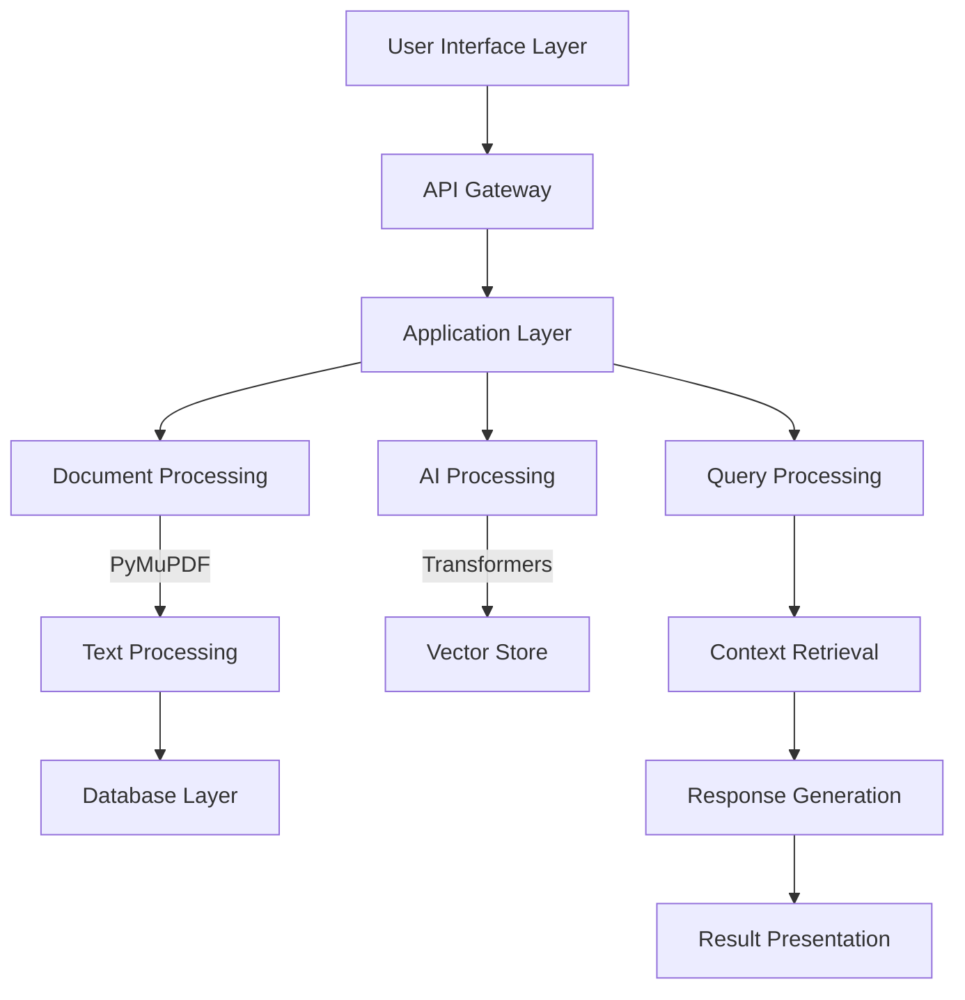

<div align="center">

# 🌌 QuantumPDF ChatApp

<p align="center">
  
</p>

[](https://github.com/Kedhareswer/QuantumPDF_ChatApp/stargazers)
[](https://github.com/Kedhareswer/QuantumPDF_ChatApp/fork)
[](LICENSE)
[](https://github.com/Kedhareswer/QuantumPDF_ChatApp/commits/main)
[](https://github.com/Kedhareswer/QuantumPDF_ChatApp/issues)
[](https://github.com/Kedhareswer/QuantumPDF_ChatApp/graphs/contributors)

*Transform your PDFs into interactive knowledge bases with AI-powered conversations*

[Features](#-features) • [Installation](#-installation) • [Usage](#-usage) • [Documentation](#-documentation) • [Contributing](#-contributing)

</div>

## 📑 Table of Contents

- [Overview](#-overview)
- [Features](#-features)
- [System Architecture](#-system-architecture)
- [Technology Stack](#-technology-stack)
- [Installation](#-installation)
- [Usage Guide](#-usage-guide)
- [Configuration](#%EF%B8%8F-configuration)
- [Performance Optimization](#-performance-optimization)
- [Troubleshooting](#-troubleshooting)
- [API Reference](#-api-reference)
- [Contributing](#-contributing)
- [License](#-license)
- [Support](#-support)

## 🎯 Overview

QuantumPDF ChatApp is an intelligent, open-source web application that revolutionizes PDF document interaction through advanced Large Language Models (LLMs). It transforms static PDF documents into dynamic, conversational knowledge bases that you can query naturally.

### Key Benefits

| Benefit | Description |
|---------|-------------|
| 🤖 AI-Powered Analysis | Interactive conversations with your PDFs using state-of-the-art LLMs |
| 🔍 Smart Search | Advanced semantic search capabilities across multiple documents |
| 🔐 Privacy-First | Option for local model deployment, keeping your documents secure |
| 📊 Citation Support | Automated source tracking and citation for all responses |
| ⚡ Real-time Processing | Quick document processing and response generation |

## ✨ Features

### Core Capabilities

| Feature Category | Components | Description |
|-----------------|------------|-------------|
| **Document Processing** | • Text Extraction<br>• Smart Chunking<br>• OCR Support<br>• Metadata Extraction | Advanced PDF processing using PyMuPDF with intelligent text chunking and OCR capabilities |
| **Search & Retrieval** | • Semantic Search<br>• Vector Similarity<br>• Multi-document Support | FAISS-powered vector search with Sentence Transformers for accurate content retrieval |
| **LLM Integration** | • Local Models<br>• Cloud APIs<br>• Custom Models | Flexible integration with various LLM providers and local model support |
| **User Experience** | • Interactive Chat<br>• Source Citations<br>• Dark/Light Mode | Modern Next.js frontend with responsive design and customizable themes |

## 🏗 System Architecture



## 🛠 Technology Stack

| Layer | Technologies | Purpose |
|-------|-------------|----------|
| **Frontend** |    | User interface and client-side logic |
| **Backend** |   | Server-side processing and API endpoints |
| **Database** |  | Document metadata and text storage |
| **AI/ML** |   | Machine learning and NLP processing |

## 📦 Installation

### Prerequisites

| Requirement | Version | Description |
|------------|---------|-------------|
| Python | ≥ 3.8 | For backend services |
| Node.js | ≥ 16 | For Next.js frontend |
| RAM | ≥ 8GB | 16GB+ recommended for local LLMs |
| GPU (Optional) | CUDA-compatible | For accelerated processing |

### Quick Start Guide

```bash
# Clone repository
git clone https://github.com/Kedhareswer/QuantumPDF_ChatApp.git
cd QuantumPDF_ChatApp

# Setup environment
cp .env.example .env
python -m venv venv
source venv/bin/activate  # Windows: .\venv\Scripts\activate

# Install dependencies
pip install -r requirements.txt
npm install

# Start services
python app.py  # Terminal 1
npm run dev    # Terminal 2
```

## 🎮 Usage Guide

### Basic Operations

| Operation | Command/Action | Description |
|-----------|---------------|-------------|
| Start Application | `http://localhost:3000` | Access the web interface |
| Upload Documents | Drag & Drop / Click Upload | Support for single/multiple PDFs |
| Query Documents | Type in chat interface | Natural language questions |
| View Sources | Click on citations | See source context |

### Advanced Features

| Feature | Configuration | Use Case |
|---------|--------------|-----------|
| Custom Models | Edit `app.py` | Integration of specialized LLMs |
| Batch Processing | Upload multiple PDFs | Compare across documents |
| Export Results | Download button | Save conversations and citations |

## ⚙️ Configuration

### Environment Variables

```env
# API Keys
OPENAI_API_KEY=your_openai_key
GEMINI_API_KEY=your_gemini_key
AIML_API_KEY=your_aiml_key

# Optional Configuration
WANDB_API_KEY=your_wandb_key
MAX_TOKENS=500
CHUNK_OVERLAP=50
```

### Model Configuration

| Parameter | Default | Description |
|-----------|---------|-------------|
| Chunk Size | 500 tokens | Text segment size for processing |
| Overlap | 50 tokens | Overlap between chunks |
| Memory Size | 10 turns | Conversation history length |
| Embedding Model | all-MiniLM-L6-v2 | Default embedding model |

## ⚡ Performance Optimization

### Hardware Recommendations

| Component | Minimum | Recommended |
|-----------|---------|-------------|
| RAM | 8GB | 16GB+ |
| CPU | 4 cores | 8+ cores |
| GPU | Optional | CUDA-enabled |
| Storage | 10GB | 20GB+ SSD |

### Optimization Tips

- Enable GPU acceleration for local models
- Implement caching for frequent queries
- Optimize chunk sizes based on document type
- Use batch processing for multiple documents

## 🆘 Troubleshooting

| Issue | Possible Cause | Solution |
|-------|---------------|----------|
| PDF Upload Fails | File size/format | Check size limits, file format |
| Slow Processing | Resource constraints | Adjust chunk size, enable GPU |
| API Errors | Invalid keys/limits | Verify API keys, check quotas |
| Memory Issues | Large documents | Adjust batch size, clear cache |

## 🤝 Contributing

We welcome contributions! Please check our [Contributing Guidelines](CONTRIBUTING.md) for details on:

- Code of Conduct
- Pull Request Process
- Development Setup
- Coding Standards

## 📄 License

This project is licensed under the [GNU GPL v3.0](LICENSE).

## 💬 Support

- [GitHub Discussions](https://github.com/Kedhareswer/QuantumPDF_ChatApp/discussions)
- [Issue Tracker](https://github.com/Kedhareswer/QuantumPDF_ChatApp/issues)
- [Documentation](https://github.com/Kedhareswer/QuantumPDF_ChatApp/wiki)

---

<div align="center">

Made with ❤️ by Kedhareswer

[](https://github.com/Kedhareswer/QuantumPDF_ChatApp/stargazers)

</div>
